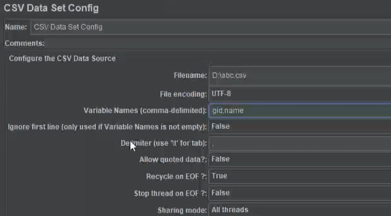
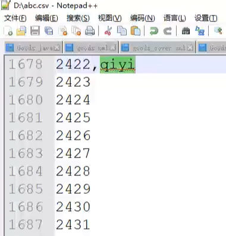
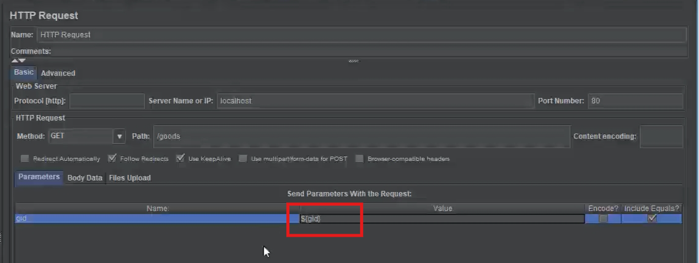

# ReadMe

### 很惭愧当前项目仍处于论证阶段，无法上线直观展示，谨奉上论证文档供斧正，望海涵！

# Jmeter

- **简介**：主流的广受开发人员好评压测工具

- **创建测试计划**

  - 

  - 

  - 

  - 

  - 

  - 

  - 
    - samples: 总执行次数
    - Min：请求最小响应时间
    - Max：请求最久响应时间
    - AVG：请求平均响应时间
    - Error：非200响应占比
    - Throughtput：QPS每秒处理请求的数量（QPS衡量系统处理并发请求能力（速率）的指标和平均响应时间成正比，要提高QPS就要设法降低每个请求的响应时间）
    - Received KB/sec ：客户端每秒接受字节量
    - Sent KB/sec ：客户端每秒发送字节量
    - PS: 经验总结一个合格的接口QPS至少要上千
    
  - 导入文本参数

    - 目的：增大测试用例覆盖范围，增强实验结果的准确度（太单一都命中缓存）
    -  Thread Group/Add/ConfigElement/CSVDataSetConfig
  
-  
    -  
    
    

# 背景

​		秒杀的**主要特性是海量用户同时查询**商品和同时尝试下单，**是典型的瞬时高并发业务**，掌握秒杀解决方案就是掌握瞬时高并发解决方案，**因此做秒杀项目并不是和某些博主为了博流量说的一样烂大街**，每个公司的业务不尽相同，**我们应该聚焦技术方案而不拘泥于具体业务流程**，提炼总结出一套高并发高可用高速度高扩展性高防护的解决方案，**举一反三可以解决各种不同业务流程的三高问题**。为实现三高特性，这个系统集成了众多高性能解决方案比如**多级缓存**，**mq异步削峰**，**防止超卖**，**分布式事务**，**分布流**，**分库分表**，每个解决方案都有不少难点

# 业务流程

-  商品管理 (略)
- 秒杀商品管理
  - 新增秒杀商品
    - 方式1：输入商品编号导入商品信息，然后录入活动字段（活动开始时间，活动结束时间）
    - 方式2：秒杀商品所有字段手动录入（标题，描述，原价，秒杀价，图片）
  - 系统管理员审核秒杀商品 --> 秒杀商品已生效/未生效
  - **定时任务扫描即将未开始的已生效的库存不为0的缓存里没有的秒杀商品预热进redis缓存的秒杀商品列表**
  - 首页请求秒杀商品列表 [分页]
  - 点击商品图片进入商品详情页
  - 若秒杀已开始则填写收货信息立即下单
    - 若库存足则扣减库存生成订单
    - 若库存不足则下单失败
  - 下单成功后跳转到支付页面支付该订单 ,支付接口不是同步的支付完成后需要定时轮询订单的支付状态，**不支付的话五分钟后订单失效归还库存通过mq的延时队列实现**
  - **对于已结束秒杀商品由定时任务清除**
  - 已开始秒杀商品可以紧急下架通过调用下架接口更改缓存中秒杀商品状态并归档即可

# 表设计

- goods： id,title,describe,price,images,status,stock,sales
- secKillGoods：id,goodId,title,describe,price,images,stock,sales,beginAt,endAt,status（1生效2失效）
- order:  id,no,goodId,secKillGoodId,userId,amount,address,mobile,reciver,payAt,status (1未支付，2已支付)

# 多级缓存设计

多级缓存架构分为静态资源多级缓存和动态资源多级缓存两条技术路线，其中静态多级缓存比较简单基本都是配置，主要难点是动态资源多级缓存

## 静态资源多级缓存设计

静态资源一般设置三级缓存，一级浏览器缓存，二级cdn缓存，三级nginx缓存。

- **浏览器缓存：**浏览器缓存配置比较简单直接在静态资源服务配置里添加cache-control请求头即可，cache-control一般选协商缓存模式
- **CDN缓存：**cdn配置也比较简单，基本配置就是源站地址，ttl，资源刷新频率。
- **Nginx缓存：**nginx就是静态资源源站服务，默认配置不开启本地缓存，为了提高性能一般我们会开启缓存和gzip压缩

## 动态资源多级缓存设计

大部分动态资源加一层redis缓存即可满足，对性能有更极致要求的可以外加一层本地缓存，对性能有更极致需求且更新频率很低的资源可以再加一层cdn缓存然后将数据静态化并推送到cdn，下面论证的就是这种极致的场景

### cdn缓存

- **为什么静态化什么时候静态化：**为什么要用cdn缓存静态化数据，第一是由于cdn遵循就近原则分发响应所以响应速度更快，第二是相同条件下**静态服务比动态服务并发处理能力更高**，可以提升系统性能缓解服务器压力，但是动态数据静态化是一个开销非常大的操作因为要模板渲染生成html, 所以要刷新频率极低的数据才适合静态化，正好秒杀商品就是这样的数据。
- **具体操作过程：**
  - 秒杀开始前通过模板引擎将商品详情静态化，然后通过cdn-sdk设置资源的ttl,自动刷新频率,回源接口地址然后推送到cdn
  - 商品更新或下架就同步删除cdn中对应的商品详情页，如果请求cdn没有资源就回源重新生成
  - 并通过先改数据后删缓存和ttl和定时回源刷新实现了最终一致性

### 本地缓存

- **PS:** 没有持久化机制只能当只读缓存不能像redis一样可读可写。
- **概述：**本地缓存也叫进程内缓存，和分布式缓存相比优点是省去了网络开销，因此节省了内网带宽和时延，缺点就是内存利用率低，没有持久化，且缓存的一致性更难以实现。根据本地缓存的这些特性可知本地缓存适合数据量少且允许分布式节点暂时不一致且分布式缓存无法满足的性能场景如电商秒杀。
- **如何保证本地缓存和数据库的一致性：**应用一般都是分布式部署，数据库需要将更新广播到每一个服务实例的本地缓存，因此不能采取集中式缓存的延时双山策略，主流的同步策略有以下几种
  - 设置缓存短时间失效，失效后去redis二级缓存或数据库获取数据，优点是实现简单，缺点是本地缓存命中率低效果不明显，不适合高并发系统
  - 设置缓存项定时刷新，实现缓存项写入后定时异步地执行刷新逻辑，比如咖啡因就提供了相关api,优点是低频刷新工况下性能很好且实现简单，缺点是一致性较弱因为刷新频率不能太高，适合高并发且一致性要求低的场景
  - 通过mq的广播模式实现更新同步，具体操作是首先将更改消息发送到广播交换机，交换机再将消息广播到所有绑定的队列，每个队列的消费者消费消息完成同步，这里面有个难点是不同消费者是同一个服务的不同副本硬编码无法做到分别绑定不同队列，一个简单的做法是节点通过ip地址加业务后缀动态创建绑定队列，除此之外还要解决引入mq带来的消息丢失，消息重复消费，消息积压问题，因此这个做法虽然一致性高性能好，但是运维开发成本也 高。
  - 通过redis发布订阅模式实现同步 // todo

### 分布式缓存

[见技术手册]()

# 下单接口设计

## 工作流程

- 校验秒杀商品是否存在秒杀是否结束库存是否大于0
- 尝试扣减库存
- 若库存扣减成功则mq异步下单
- 客户端根据用户id和秒杀商品id每隔三秒检查订单是否生成
- 订单生成后跳转至支付页面支付该订单


## 防止超卖

下单前要经过库存判断和库存扣减两个步骤，并发进行库存判断和库存扣减而不保证这两个操作的原子性就可能导致超卖，因此关键在于保证库存判断和库存扣减原子执行，有以下几种方案。

###  update语句判断扣减

如果并发要求不高可以直接用update sql语句判断扣减,因为update会获取行锁所以操作是并发安全的，比如update product set stock=stock-1 where stock>0，但是mysql单机写qps只有4000左右不能满足秒杀的并发需求，最主流的做法是将扣减库存放到redis中进行（众所周知redis是性能极高的nosql单片写qps达4万读qps达10w左右）但放redis也有好几种扣减方案各有优劣

### 通过分布式锁防止超卖

具体操作是以商品id为key获取分布式锁阻塞其他请求然后判断库存和扣减库存完了再释放分布式锁，这种方案要额外增加两次网络io阻塞时间过长并发性能不理想不推荐

### 通过库存队列防止超卖

具体做法是在redis创建秒杀商品对应的库存队列，库存是多少队列长度就是多少，扣减一个库存就是出队一个元素，扣完即止，redis是单线程执行的没有并发问题，优点是简单粗暴性能好，坏处是库存多的话浪费内存

### 通过lua脚本防止超卖

由于redis是单线程执行命令的，我们可以将库存判断和库存扣减编在一个lua脚本执行，这种方案比分布式锁性能更好，比库存队列省内存，但是集群环境下可能不够可靠，就是主库扣减完库存还没来记得同步到从库就宕机了，导致新的主从还是老库存，

## 为什么要mq异步下单？

- 因为写操作开销比较大，在秒杀接口同步等待写操作的话会造成秒杀接口平均响应时长下降从而降低系统qps
- 因为秒杀接口瞬时访问并发很高如果不解耦下单接口，瞬时流量直接传导下单服务因为下单开销比较高所以很容易击穿下单服务，导致系统雪崩
- 所以下单操作不仅要异步还要削峰解耦所以用mq异步下单是最合适的

## 用mq做异步通知会带来哪些问题及如何解决？

### 消息重复消费导致重复下单的幂等性问题

- **什么是幂等性**：一个操作执行一次和多次的影响是一致的，这个操作就是幂等的，比如查询接口更新（天然幂等）接口秒杀接口（天然不幂等要额外保障）
- **高并发场景下如何保证接口幂等性（如何保证消息消费的幂等性）**
  - mq的消息投递使用ack确认和重试机制，一旦出现网络波动可能会出现消息成功消费了但未ack然后消息又被重试投递消费的情况，也就是消息被重复消费了导致业务不一致，因此引入mq必须要解决消息重复消费问题，保证消息消费的幂等性即可避免消息重复消费问题，保证消息消费幂等性有以下几种方案
  - 第一种方式 是消息维护一个唯一id并在数据库创建对应的唯一索引，消息消费前先查询消息是否被消费过，未消费过就尝试插入，行锁和唯一索引会保证只有一个相同唯一id的记录成功插入从而保证了操作的幂等性，由于幂等性实现强依赖数据库读写性能因此高并发场景不适合
  - 第二种方式是通过分布式锁实现操作幂等，消息消费前通过自身的唯一id获取分布式锁比如redis分布式锁就是以自身唯一id为key执行setnx设置成功就是未消费过否则就是以消费过（即使key过期了也不怕依然有mysql的唯一索引兜底）
- **防止重复提交和幂等性的区别**
  - 不是一个维度的概念，防止重复的提交不一定是幂等的比如同样的请求插入多次就生成多片相同的文章，防止重复提交强调的是同一个表单防止疯狂点击或脚本刷单，前端防重可以设置按钮点击置灰，后端防重需要引入接口token验证机制，具体流程如下
    - 前端表单提交前向后端请求token,后端生成token响应给前端并保存在redis中
    - 前端表单提交时请求头带上token,后端校验token是否有效，然后去redis查看token是否存在,存在就是合法的提交，否则非法

### 消息积压问题

- 队列消息消费速度跟不上消息产生速度就会导致消息积压问题，消息积压倒不是担心队列溢出因为队列可以存储亿级别的消息，而是会导致客户端等待时间过长影响用户体验，解决消息积压的根本就是加快消息消费速度，首先可以把消息逐个插入数据库优化成多线程并行批量插入数据库，还积压就把等待时长达到一定阈值的消息暂时写道redis里，然后开一个守护线程慢慢消化这些数据道mysql--[引申redis脑裂问题]，优化后还不能满足就只能加机器水平拓展分片了。

# 分布式事务

首先我觉得最好的分布式事务就是没有分布式事务，因为业界对于分布式事务并没有一个非常完美的解决方案，而是绝大部分场景引入分布式事务的成本比本地还高，得不偿失。如果不得不上分布式事务有以下不同方案可供选择

基于 XA 的强一致事务使用相对简单，但是无法很好的应对互联网的高并发或复杂系统的长事务场景； 柔性事务则需要开发者对应用进行改造，接入成本非常高，并且需要开发者自行实现资源锁定和反向补偿。

分布式事务所说的一致性是义务状态一致性不是cap理论中的副本数据一致性比如转账前后双方余额之和要保持一致，由于不能保证分支事务同一时刻提交，所以目前没有强一致性的分布式事务解决方案只有一致性很强的分布式方案，如果非得实现强一致性的分布式事务根据cap理论就是保cp牺牲可用性，具体做法是开启事务前加一层分布式锁拦截请求完成事务后释放可用性很低显然得不偿失。

## 两阶段提交

两阶段提交协议就是由准备和提交两个阶段组成的分布式事务模型

- 准备阶段是指，事务协调者**请求**事务参者与**准备状态**，事务参与者**锁定资源响应是否准备就绪**
- 提交阶段是指，若事务协调者收到所有事务参与者的准备就绪就广播提交事务，否则就广播回滚事务、

优点是一致性强，使用简单，缺点是长时间锁定资源并发度低，事务协调器单点故障会有死锁风险，两阶段常见的实现方案有AX方案和AT方案

- XA协议定义了利用数据库sql实现两阶段提交的接口主流数据库基本都实现了支持以mysql为例准备阶段就执行xa prepare xid命令检查指定事务，提交阶段就执行xa commit xid命令提交指定事务
- 为什么要专门的xa sql是因为这样才可以完全在数据库层面实现准备与提交或回滚，如果只用普通的事务语句的话无法指定事务id，而且需要在业务层才能监控本地事务的准备状态
- AT是seat发明的两阶段模式具体情况忘了

## 三阶段提交协议

三阶段是两阶段的改进，主要改进了是加了一个cancommit阶段检查参与是否具备进入准备阶段的条件比如网络是否畅通，这个方案同步阻塞比2pc还严重应用不广泛

## saga

- saga是一种通过执行反·向补偿操作实现回滚的事务模型，其核心思想是将长事务拆分成多个独立提交的短事务及其反向补偿操作然后由事务协调器协调执行，当某个短事务发生异常后协调器先重试尝试正向补偿不行再按相反的顺序执行各短事务的反向补偿操作从而实现回滚，saga模型的优点是实现简单，不依赖数据库，适合长事务（因为事务的编排在事务管理器进行（即分支事务的调度观测重试由事务管理器执行，之所以tcc的事务编排在应用程序进行是为了满足更高的灵活性比如嵌套tcc），不受应用程序重启阻塞的影响），性能较好因为各事务独立执行不用锁定资源，缺点是不满足隔离性和一致性较差，不满足隔离性是因为分支事务的写入没有未提交概念只有反向补偿概念从而导致全局事务有脏写的风险（不保证隔离性就会有脏读脏写的风险脏读就是读到了假的数据脏写就是修改了未提交的数据会造成修改丢失修改丢失会造成业务不一致性如累加失踪比如这里的负余额）脏写就会造成业务不一致，比如A账号冲值了100块还没来得及反向补偿这100块就被花掉了这就会造成-100元的余额，一致性较弱指的是不一致性状态从第一个正向操作开始到最后一个正向操作或反向操作结束期间一直处于不一致状态相比之下那些两阶段提交协议只有各个comit间隙存在不一致状态

## tcc

- tcc是一种由try-confirm-cancal三个阶段组成的事务模式，本质上是由业务层实现的侵入式的两阶段提交协议，所谓的侵入式是指通过增加预留资源字段代替锁实现资源的非阻塞锁定（资源被锁定就打回写请求重试防止脏写但不会锁住资源阻塞其他读请求因为瓶颈在数据库所以无锁性能更好），所以他的优点是并发性能很高，还有一致性也较高略逊于AX模式但高于所有其他模式 ，缺点是侵入性强实现复杂耦合度高（优缺点差不多得了因为都是看和谁对比）
- tcc的工作流程分try confirm cancal三个阶段或者说两个阶段
  - try阶段的工作是执行各分支事务的业务检查，具体来说就是各分支事务检查当前操作如果执行的话是否符合业务一致性，是的话就将待执行资源预留备用   ，然后将检查结果通知事务协调器（有行锁不担心检查期间被篡改就算没有行锁也可以改好重查）
  - confirm阶段的工作是   如果所有分支事务都成功就通知各分支事务执行确认操作所谓的确认操作就是释放预留资源并将预留资源应用到业务字段 
  - cancal阶段的工作是     如果有分支事务失败就通知各分支事务执行回滚操作，所谓的回滚操作就是释放预留资源停止锁定行为
- 以订单支付为例介绍tcc分布式事务模式的具体应用首先订单支付操作包含订单状态修改和库存扣减两个分支事务
  - 在try阶段判断订单状态是不是未支付是的话就将订单状态改成正在支付，判断库存够不够扣并将预扣除数量预留到预留资源字段
  - 所有分支事务检查都成功就通知所有分支事务执行confirm操作即将等待状态改为已支付，将预留的扣除库存释放并实施真正的扣除
  - 有分支事务失败就通知成功的执行回滚操作比如订单状态检查失败需要将预留的扣除库存释放回到正常状态

## 本地消息表

​		一般来说本地消息表的作用是向消息队列发送消息进行异步调用前先将消息记录在本地消息表跟踪消费状态防止消息丢失，同时也有跟踪分支事务状态的作用，如果消息消费失败或超时就可以被视为是分支事务失败然后就可以通过关联的全局事务id字段进行正向补偿了，缺点显而易见就是开销比较大因为要记录消息和不断轮询本地消息表，还有一个缺点就是不保证事务隔离性因为个分支事务并不知道各自的资源是否被锁定

​		异步调用一般都是无需业务一致性检查的操作因为异步调用前一般都做好了一致性检查因此一般不需要考虑回滚只需要保证正向补偿最终一致性即可，一旦一步操作需要一致性性检查为了保证隔离性势必将消息表侵入到正常的业务访问还要注册反向补偿模拟回滚

## 事务消息

mq事务消息就是消息队列内建本地消息表来取代本地消息表从而提升了处理速度，rocketmq就有先关实现具体没了解过

# 限流

当请求数量超过服务阈值后服务会越来越慢直至宕机，因此给服务设置限流是必要安防手段，主要的限流算法有计数器法，滑动窗口法，桶令牌法等

## 计数器法

计数器法的思路很简单，就是将时间轴划成等长的固定窗口，请求进来就累加到所在窗口的计数器，如果计数器到达阈值就拒绝请求，优点是简单粗暴，缺点是窗口边界左右流量之和超过阈值，导致限流毛刺

```go
type CountLimiter struct {
    rate  int64         // 计数周期内运行的最大请求数
    begin time.Time     // 当前轮计数开始时间
    count int64         // 当前计数周期累计的请求数
    cycle time.Duration // 计数周期，如统计1秒内的总请求数，那么计数周期就是1秒
    lock  sync.Mutex    // 判断能否放行时需要加锁操作
}
func NewCountLimiter(rate int64, cycle time.Duration) *CountLimiter {
    return &CountLimiter{
        rate:  rate,
        begin: time.Now(),
        count: 0,
        cycle: cycle,
        lock:  sync.Mutex{},
    }
}
func (c *CountLimiter) Allow() bool {
    c.lock.Lock()
    defer c.lock.Unlock()
    if c.count == c.rate { // 达到最大限流时，判断时间是否也超过统计周期了，超了可以重置限流器了，没有超说明还在当前统计周期内，应该拦截
        if time.Now().Sub(c.begin) > c.cycle {
            c.Reset()
            return true
        } else {
            return false
        }
    } else { // 还没有达到最大限流数，那么不管时间周期是否超出统计计数周期，都可以放行
        c.count++
        return true
    }
}

func (c *CountLimiter) Reset() {
    c.begin = time.Now()
    c.count = 0
}
func main() {
    countLimiter := NewCountLimiter(3, time.Second) // 1s内不可超过3个请求
    var wg sync.WaitGroup
    wg.Add(10)
    for i := 0; i < 10; i++ {
        go func(i int) {
            defer wg.Done()
            if countLimiter.Allow() {
                fmt.Println(fmt.Sprintf("当前时间%s,请求%d通过了", time.Now().String(), i))
            } else {
                fmt.Println(fmt.Sprintf("当前时间%s,请求%d被限流了", time.Now().String(), i))
            }
        }(i)
        time.Sleep(200 * time.Millisecond)
    }
    wg.Wait()
}
```

## 滑动窗口限流

为了改善限流毛刺可以将固定窗口法升级为滑动窗口法，滑动窗口的思路是在时间轴上安装一个随动的滑动窗口，请求都打在滑动窗口的计数器上超过阈值就拒绝，滑动窗口的优点是极大改善了固定窗口的毛刺问题（本质上滑动窗口随动前进过程中丢弃的区间比例更低所以失真概率更低，而固定窗口切换会丢弃前前面的整个窗口丢弃的区间比例远远超越所以失真的概率更大），缺点是实现较为复杂。（可以理解为一辆传送带上的随动小车接收投篮）

可以用redis的zset实现滑动窗口限流：

- 定义窗口时长和请求阈值
- 核心逻辑是以时间戳为成员加入zset并积分加一若已存在该成员就积分自增，在此之前还要清除过期成员和判断请求是否超过阈值，清楚过期成员即清楚时间戳少于当前时间减窗口长度的成员，是否超过阈值就是通过zsum统计窗内积分是否超过阈值

优点：这种算法极大改善了固定窗口毛刺问题；缺点：但无法杜绝毛刺且内存消耗较大

## 漏桶算法

漏桶算法很朴实无华却很实用，思想是流量都先打在一个漏桶里，然后通过漏洞流出，既起到了限流的作用还能缓冲流量削峰填谷，本质上和mq的削峰填谷是一个思想因此可以用mq来实现漏桶限流

go实现：

```go
// LeakyBucket 结构体表示漏桶
type LeakyBucket struct {
	mu         sync.Mutex // 互斥锁，用于保护共享资源
	capacity   int        // 桶的容量
	rate       int        // 流出速率（每秒流出的请求数）
	lastTime   time.Time  // 上次更新时间
	currentSize int       // 当前桶中的请求数
}

// NewLeakyBucket 创建一个新的漏桶
func NewLeakyBucket(capacity, rate int) *LeakyBucket {
	return &LeakyBucket{
		capacity: capacity,
		rate:     rate,
		lastTime: time.Now(),
	}
}

// Allow 检查是否允许当前请求通过
func (lb *LeakyBucket) Allow() bool {
	lb.mu.Lock()
	defer lb.mu.Unlock()

	now := time.Now()
	elapsed := now.Sub(lb.lastTime).Seconds()

	// 计算在时间间隔内应该流出的请求数
	leaked := int(elapsed * float64(lb.rate))

	// 更新桶中的请求数
	lb.currentSize = max(0, lb.currentSize-leaked)

	// 如果桶未满，则允许请求通过，并增加桶中的请求数
	if lb.currentSize < lb.capacity {
		lb.currentSize++
		lb.lastTime = now
		return true
	}

	// 如果桶已满，则拒绝请求
	return false
}

// max 返回两个整数中的较大值
func max(a, b int) int {
	if a > b {
		return a
	}
	return b
}

// 示例主函数
func main() {
	bucket := NewLeakyBucket(10, 2) // 容量为10，流出速率为2个请求/秒

	for i := 0; i < 20; i++ {
		if bucket.Allow() {
			fmt.Printf("Request %d allowed\n", i)
		} else {
			fmt.Printf("Request %d rejected\n", i)
		}
		time.Sleep(300 * time.Millisecond) // 模拟请求之间的间隔
	}
}
```

## 令牌桶

令牌桶应用场景比较少，就是以恒定速度往桶里投放令牌直到溢出，消费者拿取令牌才放行，适合平时受限于令牌产生速率，但又能承受突发桶倾泻

流量的场景

实现：略

# 部署

```yml
apiVersion: apps/v1
kind: Deployment
metadata:
  name: sec_kill
  labels:
    app: nginx
spec:
  replicas: 3  # 设置副本数量
  selector:
    matchLabels:
      app: sec_kill
  template:
    metadata:
      labels:
        app: sec_kill
    spec:
      containers:
      - name: sec_kill
        image: registry.cn-hangzhou.aliyuncs.com/chenyuantao/sec_kill #镜像
        ports:
        - containerPort: 80  # 容器内部监听的端口
        livenessProbe:  # 活跃度探针，确保容器运行正常
          httpGet:
            path: /liveness
            port: 80
          initialDelaySeconds: 5
          periodSeconds: 1 
```

# 自动扩缩容

```yml
apiVersion: autoscaling/v2beta2
kind: HorizontalPodAutoscaler
metadata:
  name: sec-kill-app-hpa
  namespace: default 
spec:
  scaleTargetRef:
    apiVersion: apps/v1
    kind: Deployment  #目标副本控制器
    name: sec_kill_deployment
  minReplicas: 1      #最小副本数量
  maxReplicas: 10     #最大副本数量
  metrics:
  - type: Resource
    resource:
      name: cpu
      target:
        type: Utilization
        averageUtilization: 50 # 目标CPU使用率为50%
  - type: Resource
    resource:
      name: memory
      target:
        type: AverageValue
        averageValue: 200Mi # 目标内存平均使用量为200 MiB
```

## Cluster Autosca //todo

